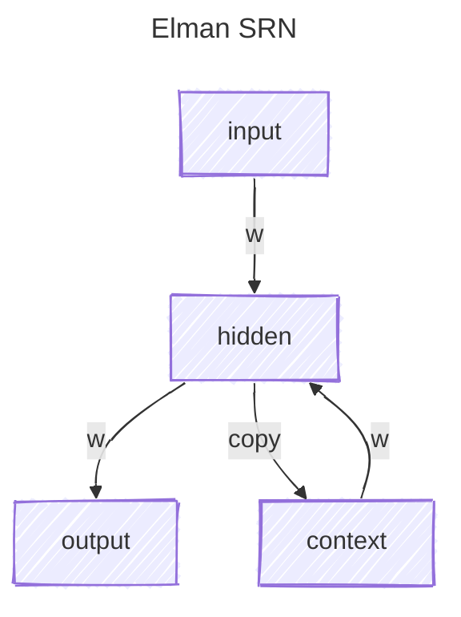

# SRN-statistical-learning-experimentation

Experimentation (playground) of simple recursive network in the domain of human statistical learning.

Based on the Elman SRN architecture, this project aims to search and demonstrate the models with which human learn language (sequences).



## Installation

This project use the [UV](https://github.com/astral-sh/uv) package manager.
To install the dependencies, run the following command from the repo directory:

```bash
uv sync
```

You can then run the experiments with:

```bash
uv run src/main.py
```

### Container

A Containerfile will also be available for development and deployment.

Install [podman](https://podman.io/) (or [docker](https://www.docker.com/) on your preferred operating system.

To build the container, from the repo directory, run

```bash
podman build -t srn-statistical-learning-experimentation .
```

## Interface

For the moment, the is no interface. The only way to use this software is through the command line.

## Documentation

### Data

Input data are meant to be in ```./data/in/```
Output data will go to ```.data/out/```

## Roadmap

- [ ] [Elman SRN](https://web.stanford.edu/group/pdplab/pdphandbook/handbookch8.html)
- [ ] Other models
- [ ] Containerfile dev and deploy
- [x] Load base data
- [ ] Define and load data format
- [ ] Make ui interface
