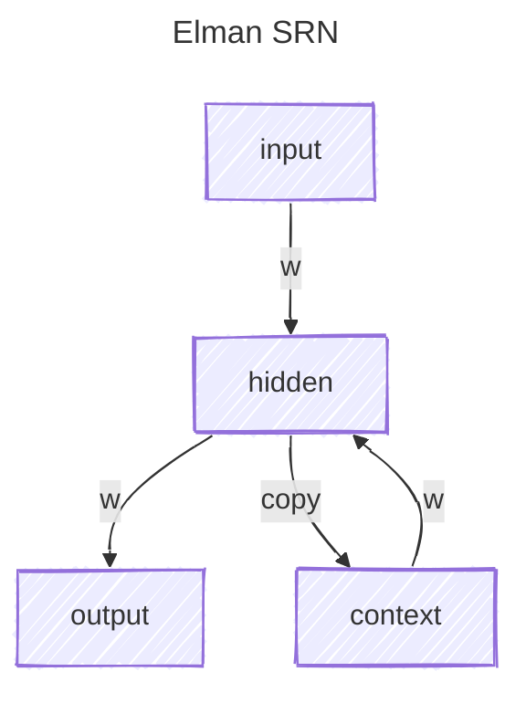

# SRN-statistical-learning-experimentation

The [experimentation notebook](https://mbontrid.github.io/SRN-statistical-learning-experimentation) can be found here.

Experimentation of simple recursive network in the domain of human statistical learning.

Based on the Elman SRN architecture, this project aims to search and demonstrate the models with which human learn language (sequences).


```mermaid
---
title: Elman SRN
config:
 look: handDrawn
---
flowchart TB

input --w--> hidden
context --w--> hidden
hidden --w--> output
hidden --copy--> context
```

## Installation

This project use the [UV](https://github.com/astral-sh/uv) package manager.
To install the dependencies, run the following command from the repo directory:

### client

```bash
uv sync
```

You can then run the experiments with:

```bash
uv run src/main.py --help

```

## Documentation

### Data

Input data are meant to be in `./data/input/`.
Output data will go to `./data/output/`.

## Roadmap

- [ ] [Elman SRN](https://web.stanford.edu/group/pdplab/pdphandbook/handbookch8.html)
- [ ] Other models
- [x] Load base data
- [x] Define and load data format
- [x] Jupyter notebook
- [ ] Make ui interface
