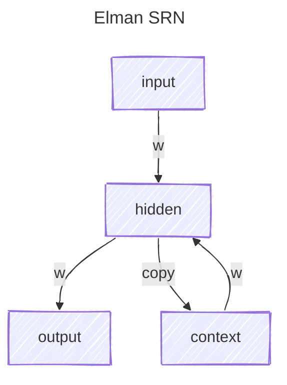

# SRN-statistical-learning-experimentation

Experimentation of simple recurrent network in the domain of human statistical learning.

The [experimentation book](https://mbontrid.github.io/SRN-statistical-learning-experimentation) can be found here.

Related paper : [Chunking or not chunking? How do we find words in artificial language learning?](https://psycnet.apa.org/record/2013-13580-007)

Based on the Elman SRN architecture, this project aims to search and demonstrate the models with which human learn language (sequences).


```mermaid
---
title: Elman SRN
config:
 look: handDrawn
---
flowchart TB

input --w--> hidden
context --w--> hidden
hidden --w--> output
hidden --copy--> context
```

## Installation

This project use the [UV](https://github.com/astral-sh/uv) package manager.
To install the dependencies, run the following command from the repo directory:

```bash
uv sync
```

You can then run the experiments with:

```bash
uv run src/main.py --help

```

## Documentation

One of the main purposes of this project is to study human learning of sequences alongside a simple recurrent neural network. For this reason, we aim for maximum transparency and thorough code documentation. We deliberately avoid complex libraries so that anyone can read the code carefully and understand exactly how it behaves.

PyTorch is used only for the convenience of tensor autograd and, when available, GPU acceleration. We do not use the  torch.nn  library, as it introduces more complex and less transparent behavior.

## project files structure

- data
  - Input data are meant to be in `./data/input/`.
  - Output data will go to `./data/output/`.
- jupyter: Contains the chapters of the jupyter book. To appear in the book, each chapter has to be listed in the toc property of myst.yml.

```
.
├── data
│   ├── input
│   │   └── Results_TR_24.xls
│   └── output
├── jupyter
│   ├── intro.md
│   ├── srn_learn.ipynb
│   └── srn_learn.ju.py
├── myst.yml
├── src
```

## Contribution


## Roadmap

- [x] [Elman SRN](https://web.stanford.edu/group/pdplab/pdphandbook/handbookch8.html)
- [ ] Other models
- [x] Load base data
- [x] Define and load data format
- [x] Jupyter notebook
- [ ] Make ui interface
- [ ] Authors name ?
