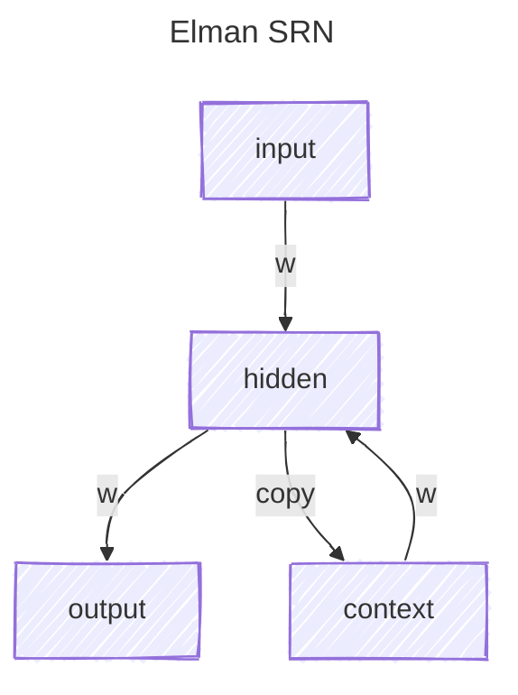

# SRN-statistical-learning-experimentation

Experimentation of simple recursive network in the domain of human statistical learning.

The [experimentation book](https://mbontrid.github.io/SRN-statistical-learning-experimentation) can be found here.

Based on the Elman SRN architecture, this project aims to search and demonstrate the models with which human learn language (sequences).


```mermaid
---
title: Elman SRN
config:
 look: handDrawn
---
flowchart TB

input --w--> hidden
context --w--> hidden
hidden --w--> output
hidden --copy--> context
```

## Installation

This project use the [UV](https://github.com/astral-sh/uv) package manager.
To install the dependencies, run the following command from the repo directory:

```bash
uv sync
```

You can then run the experiments with:

```bash
uv run src/main.py --help

```

## Documentation

One of the main purpose of this project is experimenting with the human learning of sequences  and a simple recurrent neural network. As such, perfect transparency and code documentation is needed. The use of complex libraries is prohibited allowing everyone to read carefully the code and understanding it's behavior.

- PyTorch is used only for the convenience autograd of tensors and possible gpu acceleration. As the torch.nn library implement complex and opaque behavior, it is not used.

## project files structure

- data
  - Input data are meant to be in `./data/input/`.
  - Output data will go to `./data/output/`.
- jupyter: Contains the chapters of the jupyter book. To appear in the book, each chapter has to be listed in the toc property of myst.yml.

```
.
├── data
│   ├── input
│   │   └── Results_TR_24.xls
│   └── output
├── jupyter
│   ├── intro.md
│   ├── srn_learn.ipynb
│   └── srn_learn.ju.py
├── myst.yml
├── src
```

## Contribution

### Jupyter

If possible, edit the .ipynb files indirectly with it's .ju.py counterpart. (using Selenium jupyter)

## Roadmap

- [x] [Elman SRN](https://web.stanford.edu/group/pdplab/pdphandbook/handbookch8.html)
- [ ] Other models
- [x] Load base data
- [x] Define and load data format
- [x] Jupyter notebook
- [ ] Make ui interface
